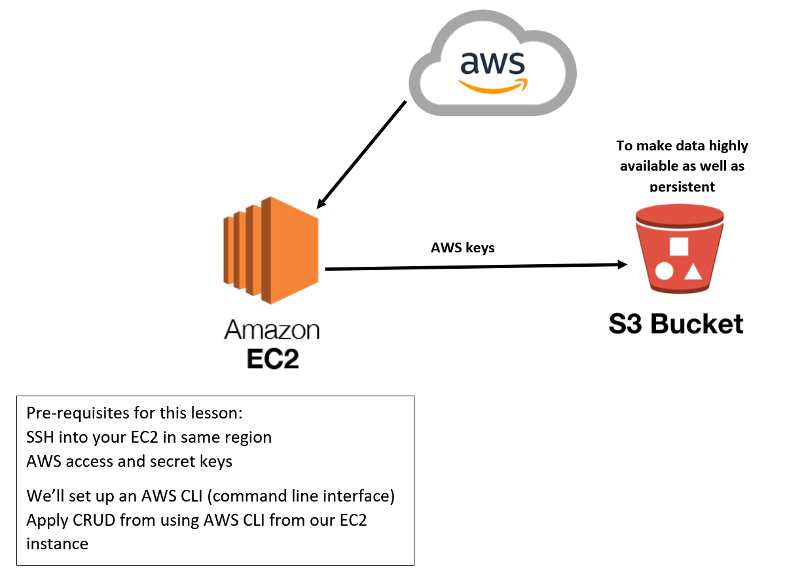

# S3 Buckets, disaster recovery and Python Boto3

## S3 bucket commands
- Create a bucket `aws s3 mb s3://BUCKETNAME`
- Add a file to the bucket `aws s3 cp test.txt s3://BUCKETNAME` test.txt is the file
- Delete file `sudo rm -rf test.txt`
- Download file from S3 bucket to EC2 instance `aws s3 cp s3://BUCKETNAME/test.txt test2.txt` test.txt is the file in S3 and test2.txt is the copy of the file
## Install the latest version of Python in EC2 instance
Follow the commands below to install the latest version of Python
- SSH into the EC2 instance
```
sudo add-apt-repository ppa:deadsnakes/ppa
sudo apt-get update
apt list | grep python3.9
sudo apt-get install python3.9
sudo update-alternatives --install /usr/bin/python3 python3 /usr/bin/python3.9 1
sudo update-alternatives --config python3
alias python=python3
sudo apt install python3.9-distutils
curl https://bootstrap.pypa.io/get-pip.py -o get-pip.py
python3.9 get-pip.py
```
### Install AWS CLI and configure
- Run `python3 -m pip install awscli`
- Run `aws configure`  
- Copy and paste access key and secret key from Excel
- Specify region `eu-west-1`
- Specify format `json`

## Boto3